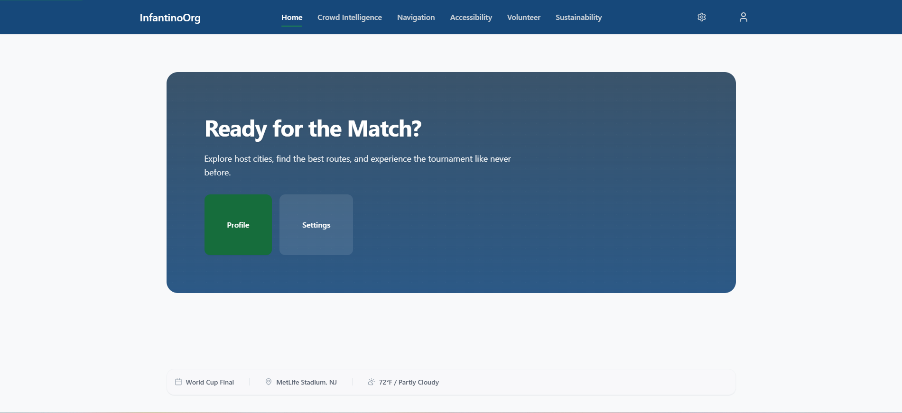

# InfantinoOrg: FIFA 2026 Tournament Assistant



InfantinoOrg is the premier AI-powered tournament match-day companion for fans attending the FIFA World Cup 2026. Designed with a strict **feature-first architecture**, it integrates cutting-edge Gemini AI, Google Maps navigation, and responsive frontend accessibility to deliver an unparalleled fan experience.

## Demo Scenario: The Fan Journey
InfantinoOrg is demonstrated through the journey of a fictional football fan, "Gianni Infantino", attending the FIFA World Cup 2026 Final at MetLife Stadium. From planning the trip and navigating crowds to accessing volunteer assistance and leaving the venue efficiently, the platform showcases how AI enhances the entire match-day experience.

## Core Features
1. **Crowd Intelligence**: Real-time heatmaps and Gemini-powered predictive crowd flow modeling to avoid congestion at venues.
2. **Smart Navigation**: Turn-by-turn accessible routing with live AI context (e.g. public transit recommendations for sustainability).
3. **Ambient AI Assistant**: Unified chat interface for requesting volunteer support, reporting incidents, and answering questions.
4. **Sustainability Tracker**: Eco-scores, public transit rewards, and nearby water/recycling hub routing.
5. **Volunteer Triage**: AI instantly routes fan requests to the nearest, most qualified volunteer.

## Technology Stack
- **Frontend**: Next.js 15, React 19, TailwindCSS, Radix UI, TypeScript
- **Backend**: FastAPI, Python 3.12, SQLModel, Uvicorn
- **AI/APIs**: Google Gemini API, Google Maps Platform
- **Testing**: Pytest, Vitest, Playwright (axe-core)

## Repository Structure
```text
infantinoorg/
├── backend/            # FastAPI Application (Python)
├── frontend/           # Next.js Application (TypeScript)
├── docs/               # Official Documentation & Engineering Reports
├── docker/             # Containerization configs
└── scripts/            # Build utilities
```

## Quick Start

### 1. Backend Setup
```bash
cd backend
python -m venv .venv
source .venv/bin/activate  # On Windows: .venv\Scripts\activate
pip install uv
uv pip install -e .
cp .env.example .env # Configure your Gemini & Maps API keys
uv run uvicorn app.main:app --reload
```

### 2. Frontend Setup
```bash
cd frontend
npm install
npm run dev
```

Visit `http://localhost:3000` to view the platform. Visit `http://localhost:8000/docs` to view the Swagger API documentation.

## Documentation
For deep-dives into the architecture, design decisions, and engineering quality reports (Lighthouse, E2E), see the official [Documentation Index](docs/04_Documentation_Index.md).
